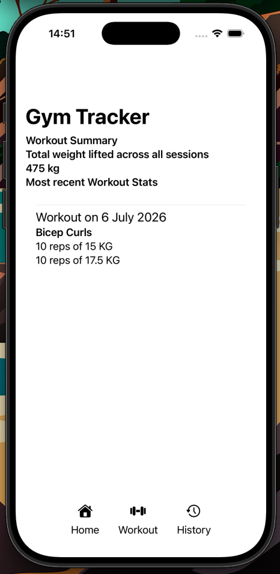
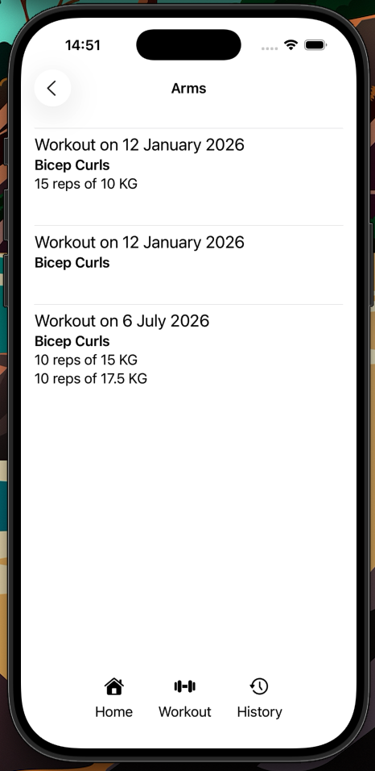
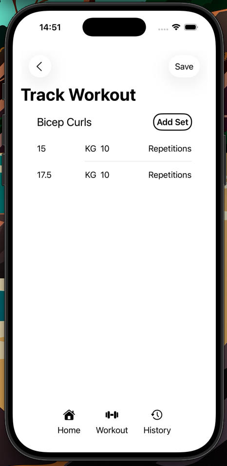

# GymTrackerSwiftUi

Simple Gym tracker project for iOS made in SwiftUi

## Swift + SwiftUI

## Overview
A simple iOS application made using Swift and apple's framework SwiftUI to track gym progress. 

## Application Architecture

The application is entirely on device with no server connection, saving all workouts locally to the phone and reading them when the app is opened again.

## Run project

To run the project a mac with X-Code is required.

Clone the repo and build the application using X-Code

## Screenshots

  
  
  

